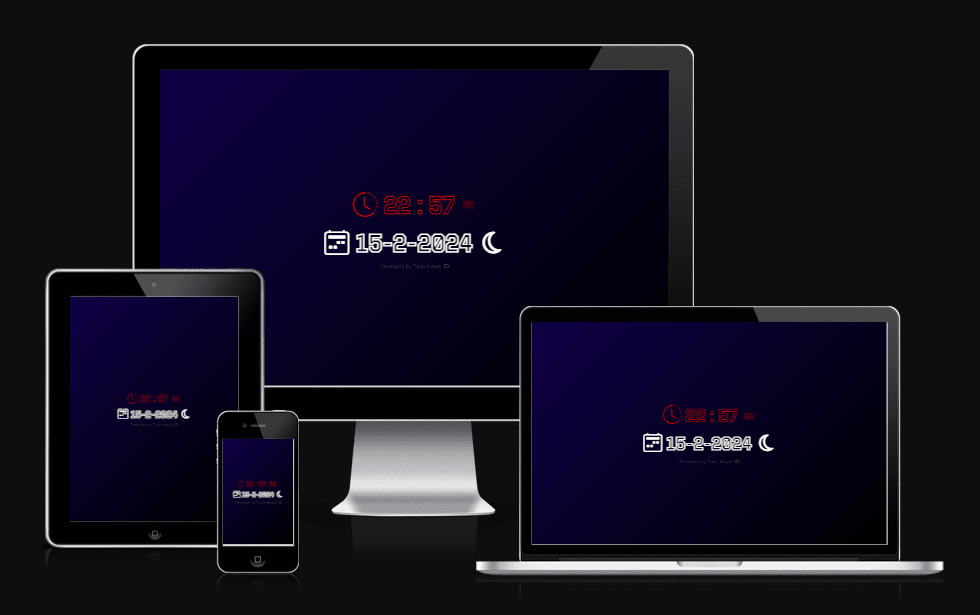
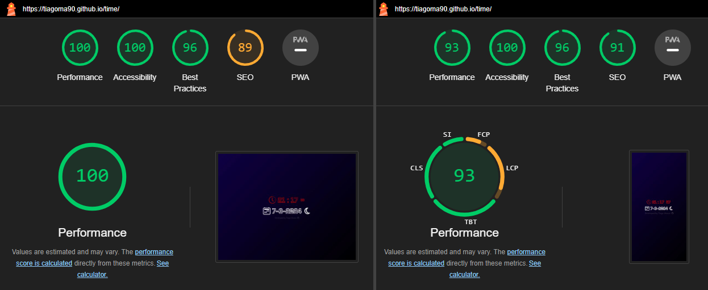

# Live Clock
The 'Clock' app is live clock that documents the Time(/Hours/Minutes/Seconds/Miliseconds) & Date(Day(Month/Year)).

Visitors of this website will find the time.

# Live Project
The live version can be found [here](https://tiagoma90.github.io/time/)

## Purpose of the website.
- To allow users to use the check the time, date, month and day.
- To allow users to to check the time, under any timezone.

# Testing
Testing has been performed for its Performance, Accessibility, Best Practices and SEO.
- With overall reviews for desktops & mobiles on 99%, under Chromes icognito mode.

# Responsiveness 
The webpage for this game was tested for various devices, making use of both DevTools "Toggle Device Toolbar (Ctrl + Shift + M") and Bytes.
It was adapted accordingly to Desktops, Laptops and Mobile devices under CSS Media queries.

# Notes for self (!Add feautures)
- Tick sound, everytime a minutes passes by. Aad another tick an hour passes by.

# Technologies
## Languages
The website was written under HTML5, CSS3 & JS(ES6).
- HTML5 - Structure of the page
- Bootstrap - CSS Framework to style of the page
- JSES6 - Logic and interactivity of the page

Other forms of development as follows:
- [Google Fonts](https://fonts.google.com/) - Source of fonts
- [Github](https://github.com/) - Host for the repository
- [Gitpod](https://gitpod.io) - Code editor
- Chrome DevTools - Testing tool
- [WAVE Evaluation tool](https://wave.webaim.org/) - Testing tool
- [Bytes.dev](https://ui.dev/amiresponsive?url=https://tiagoma90.github.io/rock-paper-scissors/) - Testing screen sizes

## Development & Deployment
The project was developed using GitHub and GitPod platforms.

- Navigate to: "Repositories" and create "New".
- Mark the following fields: ✓ Public ✓ Add a README file.
- Select template: "Code-Institute-Org/gitpod-full-template".
- Add a Repository name: "clock".
- And create Repository.

This project was developed using GitPod and suffered various executions using the inbuild Terminal.
- git add . - Command used before commiting.
- git commit -m "written imperative declaration" - Command used to declare changes and updates.
- git push - Command used to push all updates to the GitHub Repository and live version.
- python -m http.server 8000 - Command used to load the website on port 8000.

The website was deployed via Github
- Under the given Repository, navigate to "Settings".
- Navigate to "Pages" from the left-hand bar.
- From here the "Source" should be set to "Deploy from branch".
- On "Branch" select "main" and save.
- The website was deployed via Github and the live website can be found [here](https://tiagoma90.github.io/time/).

## Fonts:
- The Fonts displayed in this website were imported from [Google Fonts](https://fonts.google.com/specimen/Tourney?query=tourney)
